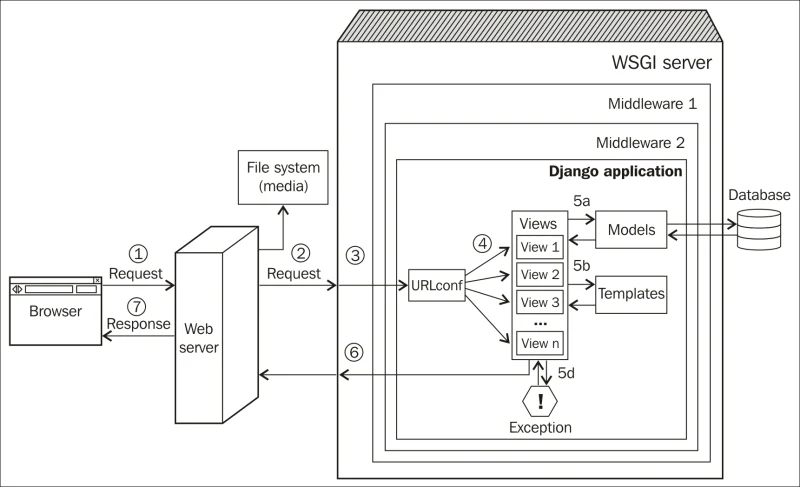

<<<<<<< HEAD
# Pelajaran ke-1 Tutorial-Django UMS

## A. Checkout branch `P1-mulai`
```
git checkout P1-mulai
```
## B. Mensetup dan Menjalankan Backend Server
### 1. Pastikan anda membuat virtual environtment `.venv` di dalam folder `mysite`
```bash
cd mysite
$ python -m venv .venv
```

### 2. Aktifkan virtual environtment
Untuk MacOs dan Linux (Bash atau Zsh Shell)
```bash
$ source .venv/bin/activate
```
Untuk Windows Command Shell (cmd)
```bash
$ . .venv/Scripts/activate
```

### 3. Upgrade pip
```bash
(.venv) $ pip install pip --upgrade
```

### 4. Install Django dan packages lainnya yang ada di file `requirements.txt`
```bash
(.venv) $ pip install -r requirements.txt
```
### 5. Jalankan server backend
```bash
(.venv) $ python manage.py runserver
```

## C. Mengerjakan Tutorial Django part 1 dan 2.
[Part 1: Requests and responses ](https://docs.djangoproject.com/en/4.2/intro/tutorial01/)

[ Part 2: Models and the admin site](https://docs.djangoproject.com/en/4.2/intro/tutorial02/)

Setelah anda selesai mengerjakan tutorial di atas, pastikan anda melakukan `commit` untuk menyimpan perubahan yang telah anda lakukan.
## D. Melihat kunci jawaban di branch `P1-selesai`
Jika anda ingin membandingkan dengan kunci jawaban yang ada, maka anda bisa melakukan checkout ke branch `P1-selesai`.
```
git checkout P1-selesai
```
=======
# tutorial-django

1. [Pelajaran ke-1: Django Request, Response, Models dan Admin.](https://github.com/dosenjelata/tutorial-django/tree/P1-mulai)
2. [Pelajaran ke-2: Django Views, Forms dan Template.](https://github.com/dosenjelata/tutorial-django/tree/P2-mulai)
3. Testing, Custom Admin, dan Static Files


Gambar 1. Arsitektur Django
>>>>>>> a69ab46ef7788365f585182603e7fd4312c608ce
